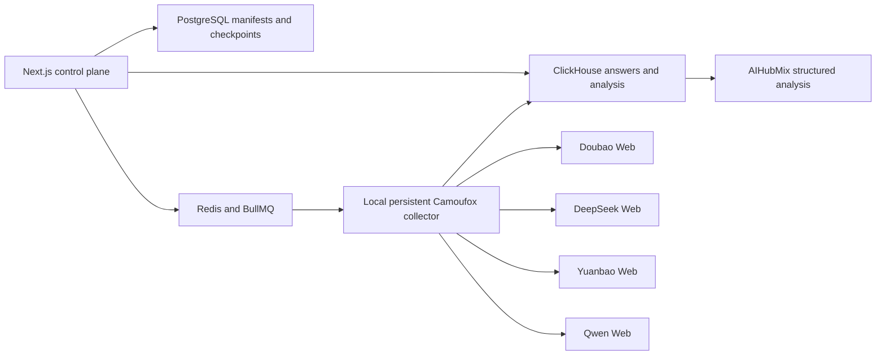

<p align="center">
  
</p>

<h1 align="center">AnswerLoom GEO Detection</h1>

<p align="center">
  Measure how an existing product appears across Doubao, DeepSeek, Yuanbao, and Qwen through their official Web interfaces.
</p>

AnswerLoom is a self-hosted GEO detection and recurring monitoring tool. It combines fixed, versioned prompt suites with persistent local browser profiles, sample-level checkpoints, structured answer analysis, and comparable reports. Model APIs are never substituted for official Web monitoring samples.

## What It Measures

- Product mention, candidate, and recommendation rates.
- Absolute rank, sentiment, target share, and competitor share.
- Blind discovery versus aided brand recognition.
- Visible source exposure and extracted citations.
- Factuality against public reference pages.
- Stability across repeated samples.
- Completion and analysis success as separate metrics.

Every failed, blocked, or unattempted checkpoint remains in the report denominator. `not_exposed` means that the provider page did not expose extractable links; it does not mean that the answer had no underlying sources.

## Detection Packs

`AnswerLoom GEO Detection Pack v1.1` contains 54 fixed templates per language: nine intents across six decision stages.

| Suite | Matrix | Core prompts per language |
| --- | --- | ---: |
| Quick Scan | All intents × Awareness and Evaluation | 18 |
| Discovery | Information, Recommendation, Scenario, Alternative × first three stages | 12 |
| Competitive Position | Recommendation, Comparison, Alternative × Screening, Evaluation, Purchase | 9 |
| Trust & Risk | Risk, Price, Brand Validation × Screening, Evaluation, Purchase | 9 |
| Buyer Journey | All intents × Awareness through Purchase | 36 |
| Full Matrix | All nine intents × all six stages | 54 |

Advanced dimensions can narrow a suite by language, intent, decision stage, brand exposure, product, competitor, audience, or region. Entity assignment is deterministic and the coverage planner adds only the minimum missing questions. It never creates a Cartesian product.

Formal detection does not accept arbitrary custom prompts. Historical custom and legacy prompts remain linked to their original samples but are excluded from new prompt sets and reports.

Sampling depth is independent from prompt coverage:

- `Single`: one sample for every prompt/provider pair.
- `Reliable`: two rounds separated by at least six hours and daily provider limits.
- `Stability`: three rounds spread across three calendar days.

## Product Flow

1. Scan the official product website.
2. Confirm the brand, category, products, audiences, regions, and competitors.
3. Select a detection suite, language, providers, dimensions, and sampling depth.
4. Review every rendered prompt and its frozen hash.
5. Create a versioned prompt set and run it across official Web providers.
6. Inspect the report by provider, locale, intent, stage, exposure, entity, or prompt.
7. Schedule the same frozen prompt set weekly or monthly for comparable trends.

## Official Web Collection

The local collector runs headed Camoufox with one persistent profile per provider. Cookies, local storage, browser fingerprints, and profiles stay on the collector machine. Each baseline prompt starts a fresh provider conversation and records its conversation ID or URL when available.

Provider challenges are never bypassed. Login expiry, QR confirmation, CAPTCHA, sliders, and security checks move the current checkpoint to `waiting_human`. Completed samples are retained, and the original run resumes after the user finishes verification.

Supported formal providers:

- Doubao
- DeepSeek
- Yuanbao (`hunyuan` internally)
- Qwen

Legacy international adapters remain in the repository for compatibility but are not part of formal AnswerLoom detection flows.

## Architecture



The collector uses the user's current network and authenticated profiles. AIHubMix is used only after collection to structure observed answers; it is not a monitoring provider.

## Local Setup

Requirements:

- macOS or Windows for the interactive collector
- Node.js 20+
- pnpm 10+
- Docker Desktop
- Python 3.12

```bash
git clone https://github.com/MYZ8088/answerloom.git
cd answerloom
cp .env.example .env
pnpm install
pnpm camoufox:setup
pnpm camoufox:doctor
pnpm local
```

Open `http://localhost:3000`, then connect each provider under `Providers`. The persistent profiles are stored under `.answerloom-storage/` and are excluded from Git.

Useful commands:

```bash
pnpm camoufox:doctor  # verify Python, Camoufox, browser, GeoIP, and executable
pnpm collector        # start only the local collector
pnpm test             # unit and fixture tests
pnpm typecheck        # workspace TypeScript checks
pnpm build            # English UI gate plus production builds
```

## Data Model

PostgreSQL stores product profiles, prompt templates, frozen prompt sets, collection series, runs, checkpoints, attempts, human challenges, provider metadata, and recurring detection schedules. ClickHouse stores raw answer samples, visible citations, structured analyses, and terminal failure records.

Existing optimization, publishing, and intervention tables are retained only for non-destructive historical compatibility. The active product does not expose or create optimization workflow data.

## Reliability Rules

- A formal series cannot start until every expected prompt hash has a checkpoint source.
- Each provider has concurrency one, with at most two providers running globally; no provider exceeds the configured daily sample limit.
- Browser restarts reuse the same persistent identity and profile.
- Prompt echoes, login pages, challenge pages, provider errors, and empty answers are rejected.
- Collection and analysis statuses are stored independently.
- Trends compare only the same prompt set, provider cohort, mode, language, and hashes.
- Offline collectors leave work in `waiting_runner` instead of dropping the series.

## Attribution

The fixed prompt methodology is derived from Yao GEO Skills at commit `136eb92c90946ea56ec63f912d5025bcbc884f39` under the MIT License. The templates are vendored and versioned; production does not download or execute the Skill, Codex, OpenCLI, or Computer Use.

AnswerLoom retains historical upstream license notices where required. See [LICENSE](LICENSE) and [THIRD_PARTY_NOTICES.md](THIRD_PARTY_NOTICES.md).

## Current Limits

- Provider UI changes may require adapter maintenance.
- CAPTCHA and account verification require a person.
- Official Web sampling is designed for a user-operated macOS or Windows collector, not an unattended Linux VPS.
- Results are observational measurements of provider output and should not be interpreted as guaranteed causal effects.
