<p align="center">
  
</p>

<p align="center">
  Measure what AI products actually answer, turn the evidence into content improvements, and retest the same questions over time.
</p>

<p align="center">
  <strong>Official Web monitoring</strong> · <strong>Evidence-led optimization</strong> · <strong>Matched retesting</strong>
</p>

<p align="center">
  
</p>

AnswerLoom is a local-first, open-source GEO workflow for measuring and improving how a brand appears in consumer AI answers. Its first-class providers are **Doubao, DeepSeek, Yuanbao, and Qwen**. Collection happens through each provider's real, signed-in Web interface rather than a model API, so the recorded answer reflects the surface a user actually sees.

The product loop is:

`brand profile → website audit → prompt library → official Web baseline → diagnosis → content optimization → human approval → publishing → T+7/T+14/T+30 retesting`

> **Beta status:** the complete workflow is represented in the application and data model, but real AI Web collection is inherently subject to provider UI changes, session expiry, and human verification. AnswerLoom does not bypass CAPTCHAs. Publisher connectors and long-running four-provider operation should be verified against your own accounts and deployment before production use.

## What Works Today

- **Four official Web providers:** Doubao, DeepSeek, Tencent Yuanbao, and Qwen.
- **Persistent Camoufox identity:** one long-lived browser profile per provider preserves cookies, local storage, locale, screen settings, and browser identity across runs.
- **Isolated samples:** every baseline prompt starts a fresh conversation and records its conversation URL or ID.
- **Human challenge recovery:** login expiry, QR login, image or slider verification, security confirmation, and UI changes pause the affected sample as `waiting_human`; completed samples remain saved.
- **Yao Full GEO Pack v1.1:** 54 versioned prompts per locale, covering nine intents across six decision stages, plus deterministic entity coverage extensions.
- **Custom prompts:** user-created and imported prompts remain separate from system templates, diagnostics, and legacy imports.
- **Traceable analysis:** visibility, factuality, evidence, stability, competition, and governance are calculated from captured Web answers.
- **Optimization workflow:** opportunities, fact-constrained content drafts, quality gates, human approval, and WordPress, GEOFlow, or GitHub PR publisher connectors.
- **Matched retesting:** a selected formal baseline is frozen and reused for T+7, T+14, and T+30 observations.
- **Durable JSON handling:** strict JSON Schema, local repair, fallback models, one bounded model repair pass, and complete attempt logs.

## Detection Tiers

| Tier | Prompt coverage per locale | Rounds | Intended use |
|---|---:|---:|---|
| Quick | 18 core prompts | 1 | Provider and early visibility scan |
| Standard | 54 core prompts plus required coverage extensions | 2 | Formal baseline |
| Deep | 54 core prompts plus required coverage extensions | 3 | Multi-day stability measurement |

The planned sample count is:

`prompt count × rounds × selected providers`

Each prompt hash receives a checkpoint before a formal run starts. Failed samples remain in the denominator, and a baseline below 90% completion is presented as provisional.

## Architecture

```mermaid
flowchart LR
  A["Brand profile and website"] --> B["Site audit and fact ledger"]
  B --> C["Yao preset and custom prompts"]
  C --> D["Local collector"]
  D --> E["Persistent Camoufox profiles"]
  E --> F["Doubao · DeepSeek · Yuanbao · Qwen"]
  F --> G["PostgreSQL and ClickHouse"]
  G --> H["Structured LLM analysis"]
  H --> I["Opportunities"]
  I --> J["Fact-constrained content review"]
  J --> K["WordPress · GEOFlow · GitHub PR"]
  K --> L["T+7 · T+14 · T+30 retests"]
  L --> G
```



The Web console owns workspaces, prompt sets, runs, reports, content, and schedules. The local collector owns provider browser profiles and only makes outbound requests. Provider cookies and browser profiles are not uploaded by the normal collector flow.

## Quick Start

### Requirements

- Node.js 20 or newer
- pnpm 10
- Docker Desktop or a compatible Docker engine
- Native macOS, Windows, or Linux desktop for real Web collection

WSL is not supported for interactive Camoufox provider sessions. A browser icon can appear under WSLg without a reliable login window.

### Install and run

```bash
git clone https://github.com/MYZ8088/answerloom.git
cd answerloom
cp .env.example .env
```

Configure one analysis provider in `.env`:

```bash
# Recommended for the current local setup
AIHUBMIX_API_KEY=your-key
AIHUBMIX_ANALYSIS_MODEL=deepseek-v4-pro
AIHUBMIX_ANALYSIS_FALLBACK_MODEL=gpt-4.1-mini
ANALYSIS_LLM_PROVIDER=aihubmix
```

OpenAI and Anthropic are also supported:

```bash
OPENAI_API_KEY=your-key
ANALYSIS_LLM_PROVIDER=openai

# or
ANTHROPIC_API_KEY=your-key
ANALYSIS_LLM_PROVIDER=claude
```

Start the local stack:

```bash
pnpm local
```

`pnpm local` installs workspace dependencies, provisions the pinned Camoufox virtual environment when needed, starts PostgreSQL, ClickHouse, and Redis, applies migrations, then starts the Web app and collector. Open [http://localhost:3000](http://localhost:3000).

### First run

1. Create or sign in to an AnswerLoom account.
2. Open **Providers** and log in to each official Web provider in the Camoufox window.
3. Open **Monitor**, scan the target website, review the suggested brand profile, and confirm the required fields.
4. Preview the complete prompt matrix, choose providers and a detection tier, then start the baseline.
5. Resolve any item shown under **Human action required** in the original provider window and resume it from the application.

Provider sessions normally survive restarts. A provider must be logged in again only when its own cookie expires, it requests a new QR scan, or it presents another account challenge.

## Reliable Structured Output

AIHubMix, OpenAI, and Anthropic do not always return usable JSON even when instructed to do so. AnswerLoom applies the same bounded strategy to answer analysis, content generation, and custom-prompt classification:

1. Request a strict JSON Schema response when the selected model supports it.
2. Fall back to JSON Object mode only when the endpoint rejects strict schema mode.
3. Extract JSON from prose or Markdown fences and repair common syntax defects locally.
4. Validate every candidate with Zod; syntactically valid but schema-invalid data is rejected.
5. Ask the configured fallback model for a fresh result.
6. If both generation attempts fail, run one final repair pass that is instructed to preserve meaning and never invent facts.
7. Persist the raw outputs, model names, finish reasons, parse mode, attempt count, and validation errors when recovery is exhausted.

There is no unbounded retry loop, and invalid output is never silently accepted as analysis.

## GEO Workflow

### 1. Profile and audit

A formal baseline requires a confirmed brand name, official domain, category, product, audience, region, and competitor. The website audit records public page snapshots, technical signals, and a source-backed fact ledger. Unverified prices, customers, certifications, rankings, cases, and performance claims cannot enter publishable content.

### 2. Prompt library

System templates, workspace instances, user custom prompts, diagnostics, and legacy imports have distinct provenance. Editing a prompt after it enters a baseline creates a new version and hash; historical runs retain the original text.

### 3. Official Web baseline

The collector submits prompts to real provider pages with per-provider concurrency of one. It rejects prompt echoes, login pages, verification pages, error states, and empty responses. A page with no extractable citation is stored as `not_exposed`, which does not mean the provider used no sources.

### 4. Diagnosis and optimization

Captured answers become evidence-linked opportunities such as factual errors, content gaps, weak evidence, poor extractability, competitor pressure, technical page issues, or missing off-site sources. Content drafts include Markdown, HTML, FAQ, JSON-LD, claim mappings, and evidence gaps, then pass explicit quality gates before human approval.

### 5. Publish and retest

Publishing requires an approved revision and an explicitly selected formal baseline. AnswerLoom stores intervention metadata and schedules matched retests. Experiment views compare prompt-level before and after answers, treatment and control cohorts, sample size, and confidence. Results are described as observational unless the evidence supports a stronger conclusion.

## Data and Privacy

- Provider cookies, local storage, and persistent browser profiles stay under `.answerloom-storage/` on the collector machine.
- PostgreSQL, ClickHouse, Redis, captured answers, and reports run locally by default.
- Captured answer text and supplied brand context are sent to the analysis provider you configure: AIHubMix, OpenAI, or Anthropic.
- Publisher credentials are encrypted with `PUBLISHER_ENCRYPTION_KEY` before storage.
- AnswerLoom does not solve or bypass provider CAPTCHAs.

Review your provider terms, privacy obligations, and applicable laws before collecting or publishing data.

## Useful Commands

| Command | Purpose |
|---|---|
| `pnpm local` | Start the local data services, Web app, and collector |
| `pnpm collector` | Start only the local collector against an existing control plane |
| `pnpm camoufox:setup` | Create or repair the pinned Camoufox runtime |
| `pnpm camoufox:doctor` | Verify Python, Camoufox, browser, GeoIP, and executable paths |
| `pnpm test` | Run Vitest tests |
| `pnpm typecheck` | Type-check every workspace package |
| `pnpm build` | Create production builds |
| `pnpm self-host` | Start the self-hosted Docker control plane |

## Current Limitations

- Provider DOM and anti-abuse behavior can change without notice. Human verification remains a normal recoverable state.
- First-time provider login requires visible browser interaction on the collector machine.
- Long-running reliability still depends on account health, the user's network, machine uptime, and provider rate limits.
- WordPress, GEOFlow, and GitHub publishing behavior must be validated against the target installation before production use.
- VPS browser collection is not the default architecture. The recommended deployment keeps the control plane hosted and the signed-in collector on the user's desktop.

## Stack

| Layer | Technology |
|---|---|
| Web application | Next.js 15, React 19, tRPC |
| Relational data | PostgreSQL, Drizzle ORM |
| Samples and analytics | ClickHouse |
| Queue and events | Redis, BullMQ |
| Browser collector | Camoufox, Playwright Core |
| Structured analysis | AIHubMix, OpenAI, or Anthropic |
| Validation | Zod, JSON Schema, jsonrepair |

## Documentation

- [Getting started](docs/getting-started.mdx)
- [Local setup](docs/local-setup.mdx)
- [Environment variables](docs/environment-variables.mdx)
- [Self-hosted setup](docs/self-hosted-setup.mdx)
- [Troubleshooting](docs/troubleshooting.mdx)
- [API reference](docs/api-reference.mdx)

## Attribution

AnswerLoom's prompt taxonomy and Web-sampling quality gates were informed by [Yao GEO Skills](https://github.com/yaojingang/yao-geo-skills). The pinned methodology is distributed under its MIT terms; see [THIRD_PARTY_NOTICES.md](THIRD_PARTY_NOTICES.md).

Camoufox, Playwright, ClickHouse, PostgreSQL, Redis, BullMQ, Drizzle, Better Auth, and other dependencies retain their respective licenses.

## License

[MIT](LICENSE)
