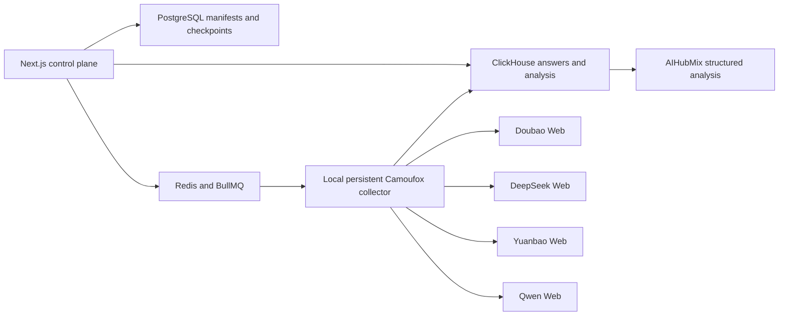

<p align="center">
  
</p>

<h1 align="center">Aloom GEO Detection</h1>

<p align="center">
  Measure how an existing product appears across Doubao, DeepSeek, Yuanbao, and Qwen through their official Web interfaces.
</p>

<p align="center">
  <strong>English</strong> · <a href="./README.zh-CN.md">简体中文</a>
</p>

Aloom is a self-hosted GEO detection and recurring monitoring tool. It uses fixed, versioned prompt suites, real official-Web collection, sample-level checkpoints, structured answer analysis, and comparable reports. Model APIs are never substituted for official-Web monitoring samples.


### What Aloom measures

- Product mention, candidate, and recommendation rates.
- Absolute rank, sentiment, target share, and competitor share.
- Blind discovery versus aided brand recognition.
- Visible source exposure and extracted citations.
- Factuality against confirmed public reference pages.
- Stability across repeated samples.
- Collection completion and analysis success as separate metrics.

Every failed, blocked, or unattempted checkpoint remains in the report denominator. `not_exposed` means that the provider page did not expose extractable links; it does not mean that the answer had no underlying sources.

### Scoring model

Aloom reports two explicit score levels:

- **Answer Performance Score**: the mean of each analysed answer's visibility, rank, sentiment, and recommendation scores, weighted 25% each. Missing or failed planned samples contribute zero to the series mean.
- **Aloom GEO Score v1**: a series-level score that combines six independent measurement layers and is calculated separately for the overall series and for each provider.

| Series layer | Weight | What it measures |
| --- | ---: | --- |
| Visibility | 25% | Measured brand appearance across all planned samples. |
| Evidence | 20% | Visible source exposure and claim support. |
| Factuality | 15% | Accuracy against the confirmed fact ledger. |
| Competition | 20% | The target's observed share against extracted competitors. |
| Stability | 10% | Agreement across repeated, mode-matched samples. |
| Governance | 10% | Collection, analysis, and required-dimension completeness. |

An unavailable layer is not silently scored as zero. Aloom normalizes the score across assessed layers, displays the assessed weight as **scoring coverage**, and marks the result provisional whenever coverage is below 100% or the formal series is incomplete. These are Aloom's independently versioned product weights. Selected measurement ideas were informed by Yao GEO Skills and OneGlanse, but the score is neither copied from nor presented as an official model from either project.

Every provider report includes its own weighted score, layer breakdown, Answer Performance Score, completion, analysis rate, mention, recommendation, absolute rank, sentiment, visible-source exposure, target share, competitor share, mode cohorts, failures, prompts, raw answers, citations, and conversation evidence.

### Detection workflow

1. Scan the official product website.
2. Confirm the brand, category, products, audiences, regions, and competitors.
3. Select a detection suite, language, providers, official-Web modes, and sampling depth.
4. Review every rendered prompt, frozen hash, expected checkpoint, and estimated duration.
5. Run each prompt in a fresh official-Web conversation.
6. Inspect the report by provider, mode, locale, intent, stage, exposure, entity, or individual prompt.
7. Schedule the same frozen prompt set weekly or monthly for comparable trends.

Formal detection does not accept arbitrary custom prompts. Historical custom and legacy prompts remain linked to their original samples but are excluded from new formal series and reports.

### Aloom GEO Detection Pack v1.1

The built-in pack contains 54 fixed templates per language: nine intents across six decision stages.

| Suite | Matrix | Core prompts per language |
| --- | --- | ---: |
| Quick Scan | All intents × Awareness and Evaluation | 18 |
| Discovery | Information, Recommendation, Scenario, Alternative × first three stages | 12 |
| Competitive Position | Recommendation, Comparison, Alternative × Screening, Evaluation, Purchase | 9 |
| Trust & Risk | Risk, Price, Brand Validation × Screening, Evaluation, Purchase | 9 |
| Buyer Journey | All intents × Awareness through Purchase | 36 |
| Full Matrix | All nine intents × all six stages | 54 |

Advanced dimensions can narrow a suite by language, intent, decision stage, brand exposure, product, competitor, audience, or region. Entity assignment is deterministic, and the coverage planner adds only the minimum missing questions. It never creates a Cartesian product.

Sampling depth is independent from prompt coverage:

- `Single`: one sample for every prompt/provider pair.
- `Reliable`: two rounds separated by at least six hours.
- `Stability`: three rounds spread across three calendar days.

### Official-Web modes

Aloom records requested and verified modes separately. Search-enabled cohorts are never merged with non-search cohorts.

| Provider | Supported text cohorts | Search rule |
| --- | --- | --- |
| Doubao | Fast, Expert | Office-agent modes are excluded from GEO text baselines. |
| DeepSeek | Fast, Expert, DeepThink, Fast + Search | Search is only valid with Instant/Fast. DeepThink + Search is rejected. |
| Yuanbao | Default, Deep Thinking, Search, Deep Thinking + Search | Search must be explicitly selected from `Tool > Search`. |
| Qwen | Auto, Fast, Thinking, plus search-enabled variants | Search is selected through `+ > More > Web search`; Aloom verifies the separate composer marker and never treats the general `Tools` switch as proof of search. |

If a platform changes or a switch cannot be verified, the sample fails with a mode-specific error instead of being mislabeled.

### Browser collection and privacy

The local collector runs task-bound headless Camoufox with one persistent profile per provider. Login, cookies, local storage, browser identity, and profiles remain on the user's computer.

- Every browser page belongs to a concrete collection task.
- All pages owned by a task are closed together when that task finishes.
- Every baseline prompt starts a fresh conversation.
- A confirmed submission is never sent again merely because extraction failed.
- Login expiry, QR confirmation, CAPTCHA, sliders, and security checks enter `waiting_human`.
- Human handling opens the same persistent profile in a visible window; Aloom does not bypass verification.
- Completed samples and checkpoints survive browser, collector, and challenge recovery.

AIHubMix is used only after collection to structure observed answers. A Full Matrix never places 54 answers into one model context: each answer receives one schema-constrained analysis call, and reports aggregate validated records deterministically.

### Architecture



### Local setup

Requirements: macOS or Windows, Node.js 20+, pnpm 10+, Docker Desktop, and Python 3.12.

```bash
git clone https://github.com/MYZ8088/aloom.git
cd aloom
cp .env.example .env
pnpm install
pnpm camoufox:setup
pnpm camoufox:doctor
pnpm local
```

Open `http://localhost:3000`, then connect each provider under `Providers`. Persistent profiles are stored under `.aloom-storage/` and are excluded from Git.

For an installation created under an earlier project name, run `pnpm brand:migrate-runtime` once before `pnpm local`. The migration copies legacy Docker volumes and local browser state into Aloom names, verifies volume sizes, keeps the legacy volumes, and backs up incomplete target volumes.

Useful commands:

```bash
pnpm camoufox:doctor  # verify Python, Camoufox, browser, GeoIP, and executable
pnpm collector        # start only the local collector
pnpm test             # unit and fixture tests
pnpm typecheck        # workspace TypeScript checks
pnpm build            # language/privacy gates plus production builds
```

### Reliability rules

- A formal series cannot start until every expected prompt hash has a checkpoint source.
- Each provider has concurrency one. Selected providers run in parallel up to `COLLECTOR_PROVIDER_CONCURRENCY` (default `4`), with an automatic reduction to `2` on low-resource machines.
- Structured analysis runs in a separate bounded background lane controlled by `COLLECTOR_ANALYSIS_CONCURRENCY` (default `2`) and never blocks official-Web collection.
- Browser restarts reuse the same persistent identity and profile.
- Prompt echoes, login pages, challenge pages, provider errors, and empty answers are rejected.
- Collection and analysis statuses are stored independently.
- Strict JSON Schema, balanced JSON extraction, local repair, Zod validation, a fallback model, and one targeted repair pass stabilize structured analysis.
- Trends compare only matching prompt hashes, providers, modes, languages, and sampling definitions.
- Offline collectors leave work in `waiting_runner` instead of dropping the series.

### Project lineage and licenses

Aloom is an independent project, not an official OneGlanse or Yao GEO Skills release.

- Parts of the original codebase and self-hosted architecture are derived from [OneGlanse](https://github.com/aryamantodkar/oneglanse), copyright 2025 Aryaman Todkar, under the MIT License. Aloom substantially reworks that foundation into a detection-only product with persistent local collectors, frozen prompt manifests, mode-aware sampling, and report-level checkpoints.
- Selected prompt-taxonomy, intent-mining, and Web-sampling quality concepts were informed by [Yao GEO Skills](https://github.com/yaojingang/yao-geo-skills) at commit `136eb92c90946ea56ec63f912d5025bcbc884f39`, copyright 2026 Yao, under the MIT License. Aloom is not a complete implementation of that Skill: its prompt pack, runner, data model, scoring, and reports are maintained independently, and it does not depend on the Skill, Codex, OpenCLI, or the remote repository at runtime.
- Aloom itself is licensed under Apache-2.0 and is copyright 2026 MYZ8088.

See [LICENSE](LICENSE) and [NOTICE](NOTICE) for the complete notices.

### Current limits

- Provider UI changes may require adapter maintenance.
- CAPTCHA and account verification require a person.
- Official-Web sampling is designed for a user-operated macOS or Windows collector, not an unattended Linux VPS.
- Results are observational measurements of provider output, not guarantees of visibility or causal effects.
