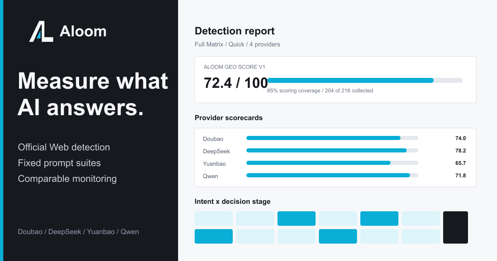
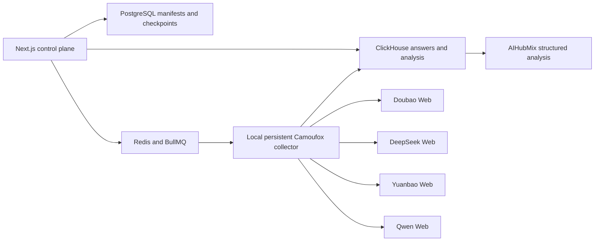

<p align="center">
  
</p>

<h1 align="center">Aloom GEO Detection</h1>

<p align="center">
  Measure how an existing product appears across Doubao, DeepSeek, Yuanbao, and Qwen through their official Web interfaces.
</p>

<p align="center">
  <a href="#english">English</a> · <a href="#简体中文">简体中文</a>
</p>

<a id="english"></a>

## English

Aloom is a self-hosted GEO detection and recurring monitoring tool. It uses fixed, versioned prompt suites, real official-Web collection, sample-level checkpoints, structured answer analysis, and comparable reports. Model APIs are never substituted for official-Web monitoring samples.



### What Aloom measures

- Product mention, candidate, and recommendation rates.
- Absolute rank, sentiment, target share, and competitor share.
- Blind discovery versus aided brand recognition.
- Visible source exposure and extracted citations.
- Factuality against confirmed public reference pages.
- Stability across repeated samples.
- Collection completion and analysis success as separate metrics.

Every failed, blocked, or unattempted checkpoint remains in the report denominator. `not_exposed` means that the provider page did not expose extractable links; it does not mean that the answer had no underlying sources.

### Detection workflow

1. Scan the official product website.
2. Confirm the brand, category, products, audiences, regions, and competitors.
3. Select a detection suite, language, providers, official-Web modes, and sampling depth.
4. Review every rendered prompt, frozen hash, expected checkpoint, and estimated duration.
5. Run each prompt in a fresh official-Web conversation.
6. Inspect the report by provider, mode, locale, intent, stage, exposure, entity, or individual prompt.
7. Schedule the same frozen prompt set weekly or monthly for comparable trends.

Formal detection does not accept arbitrary custom prompts. Historical custom and legacy prompts remain linked to their original samples but are excluded from new formal series and reports.

### Aloom GEO Detection Pack v1.1

The built-in pack contains 54 fixed templates per language: nine intents across six decision stages.

| Suite | Matrix | Core prompts per language |
| --- | --- | ---: |
| Quick Scan | All intents × Awareness and Evaluation | 18 |
| Discovery | Information, Recommendation, Scenario, Alternative × first three stages | 12 |
| Competitive Position | Recommendation, Comparison, Alternative × Screening, Evaluation, Purchase | 9 |
| Trust & Risk | Risk, Price, Brand Validation × Screening, Evaluation, Purchase | 9 |
| Buyer Journey | All intents × Awareness through Purchase | 36 |
| Full Matrix | All nine intents × all six stages | 54 |

Advanced dimensions can narrow a suite by language, intent, decision stage, brand exposure, product, competitor, audience, or region. Entity assignment is deterministic, and the coverage planner adds only the minimum missing questions. It never creates a Cartesian product.

Sampling depth is independent from prompt coverage:

- `Single`: one sample for every prompt/provider pair.
- `Reliable`: two rounds separated by at least six hours.
- `Stability`: three rounds spread across three calendar days.

### Official-Web modes

Aloom records requested and verified modes separately. Search-enabled cohorts are never merged with non-search cohorts.

| Provider | Supported text cohorts | Search rule |
| --- | --- | --- |
| Doubao | Fast, Expert | Office-agent modes are excluded from GEO text baselines. |
| DeepSeek | Fast, Expert, DeepThink, Fast + Search | Search is only valid with Instant/Fast. DeepThink + Search is rejected. |
| Yuanbao | Default, Deep Thinking, Search, Deep Thinking + Search | Search must be explicitly selected from `Tool > Search`. |
| Qwen | Auto, Fast, Thinking, plus search-enabled variants | Aloom explicitly reads and verifies the input `Tools` switch; model mode alone never implies search. |

If a platform changes or a switch cannot be verified, the sample fails with a mode-specific error instead of being mislabeled.

### Browser collection and privacy

The local collector runs task-bound headless Camoufox with one persistent profile per provider. Login, cookies, local storage, browser identity, and profiles remain on the user's computer.

- Every browser page belongs to a concrete collection task.
- All pages owned by a task are closed together when that task finishes.
- Every baseline prompt starts a fresh conversation.
- A confirmed submission is never sent again merely because extraction failed.
- Login expiry, QR confirmation, CAPTCHA, sliders, and security checks enter `waiting_human`.
- Human handling opens the same persistent profile in a visible window; Aloom does not bypass verification.
- Completed samples and checkpoints survive browser, collector, and challenge recovery.

AIHubMix is used only after collection to structure observed answers. A Full Matrix never places 54 answers into one model context: each answer receives one schema-constrained analysis call, and reports aggregate validated records deterministically.

### Architecture



### Local setup

Requirements: macOS or Windows, Node.js 20+, pnpm 10+, Docker Desktop, and Python 3.12.

```bash
git clone https://github.com/MYZ8088/aloom.git
cd aloom
cp .env.example .env
pnpm install
pnpm camoufox:setup
pnpm camoufox:doctor
pnpm local
```

Open `http://localhost:3000`, then connect each provider under `Providers`. Persistent profiles are stored under `.aloom-storage/` and are excluded from Git.

For an existing AnswerLoom or OneGlanse installation, run `pnpm brand:migrate-runtime` once before `pnpm local`. The migration copies legacy Docker volumes and local browser state into Aloom names, verifies volume sizes, keeps the legacy volumes, and backs up incomplete target volumes.

Useful commands:

```bash
pnpm camoufox:doctor  # verify Python, Camoufox, browser, GeoIP, and executable
pnpm collector        # start only the local collector
pnpm test             # unit and fixture tests
pnpm typecheck        # workspace TypeScript checks
pnpm build            # language/privacy gates plus production builds
```

### Reliability rules

- A formal series cannot start until every expected prompt hash has a checkpoint source.
- Each provider has concurrency one; daily limits and randomized cooldowns prevent burst sampling.
- Browser restarts reuse the same persistent identity and profile.
- Prompt echoes, login pages, challenge pages, provider errors, and empty answers are rejected.
- Collection and analysis statuses are stored independently.
- Strict JSON Schema, balanced JSON extraction, local repair, Zod validation, a fallback model, and one targeted repair pass stabilize structured analysis.
- Trends compare only matching prompt hashes, providers, modes, languages, and sampling definitions.
- Offline collectors leave work in `waiting_runner` instead of dropping the series.

### Project lineage and licenses

Aloom is an independent project, not an official OneGlanse or Yao GEO Skills release.

- Parts of the original codebase and self-hosted architecture are derived from [OneGlanse](https://github.com/aryamantodkar/oneglanse), copyright 2025 Aryaman Todkar, under the MIT License. Aloom substantially reworks that foundation into a detection-only product with persistent local collectors, frozen prompt manifests, mode-aware sampling, and report-level checkpoints.
- The prompt taxonomy, intent-mining approach, Web sampling quality gates, and analysis methodology are adapted from [Yao GEO Skills](https://github.com/yaojingang/yao-geo-skills) at commit `136eb92c90946ea56ec63f912d5025bcbc884f39`, copyright 2026 Yao, under the MIT License. Aloom vendors versioned templates and does not depend on the Skill, Codex, OpenCLI, or the remote repository at runtime.
- Aloom itself is licensed under Apache-2.0 and is copyright 2026 MYZ8088.

See [LICENSE](LICENSE), [NOTICE](NOTICE), and [THIRD_PARTY_NOTICES.md](THIRD_PARTY_NOTICES.md) for the complete notices.

### Current limits

- Provider UI changes may require adapter maintenance.
- CAPTCHA and account verification require a person.
- Official-Web sampling is designed for a user-operated macOS or Windows collector, not an unattended Linux VPS.
- Results are observational measurements of provider output, not guarantees of visibility or causal effects.

---

<a id="简体中文"></a>

## 简体中文

Aloom 是一个自托管的 GEO 检测与周期监测工具。它使用固定、可版本化的提示词套件，通过豆包、DeepSeek、元宝和千问的官方 Web 页面采集真实回答，并以样本级 checkpoint、结构化分析和可比报告评估现有产品的 AI 可见性。模型 API 不会被用来冒充官方 Web 检测结果。

### 检测指标

- 品牌/产品出现率、候选率与推荐率。
- 绝对排名、情感、目标份额与竞品份额。
- 品牌盲测与品牌显式测试的差异。
- 页面可见信源、引用链接与引用支持度。
- 对照已确认公开事实的事实准确性。
- 多轮采样的回答稳定性。
- 分开统计采集完成率与结构化分析成功率。

失败、阻塞和未执行的 checkpoint 都保留在报告分母中。`not_exposed` 只表示平台页面没有暴露可抽取链接，不代表回答没有底层信源。

### 使用流程

1. 扫描产品官网。
2. 确认品牌、品类、产品、受众、地区和竞品。
3. 选择检测套件、语言、平台、官方 Web 模式和采样深度。
4. 预览实际提示词、冻结 hash、全部 checkpoint 与预计周期。
5. 每条提示词在独立新对话中执行。
6. 按平台、模式、语言、意图、阶段、品牌暴露方式、实体或单条提示词查看报告。
7. 使用同一冻结提示词集创建周度或月度周期监测。

正式检测不接受任意自定义提示词。历史 custom 与 legacy 提示词仍与原样本关联，但不会进入新的正式检测和报告。

### Aloom GEO Detection Pack v1.1

每种语言内置 54 条固定模板，由 9 类意图与 6 个决策阶段组成。

| 套件 | 矩阵 | 每语言核心题数 |
| --- | --- | ---: |
| Quick Scan | 全部意图 × 认知、评估 | 18 |
| Discovery | 信息、推荐、场景、替代 × 前三个阶段 | 12 |
| Competitive Position | 推荐、比较、替代 × 筛选、评估、采购 | 9 |
| Trust & Risk | 风险、价格、品牌验证 × 筛选、评估、采购 | 9 |
| Buyer Journey | 全部意图 × 认知到采购 | 36 |
| Full Matrix | 完整 9 × 6 矩阵 | 54 |

高级筛选支持语言、意图、阶段、品牌盲测/显式测试、产品、竞品、受众和地区。实体分配是确定性的，覆盖器只补充必要缺口，不生成完整笛卡尔积。

采样深度与提示词数量相互独立：

- `Single`：每个提示词与平台组合采样一次。
- `Reliable`：采样两轮，两轮至少间隔 6 小时。
- `Stability`：采样三轮，分布在三个自然日。

### 官方 Web 模式与联网搜索

Aloom 会分别保存“请求模式”和“页面验证后的实际模式”。联网与非联网 cohort 不会混合统计。

| 平台 | 支持的文本检测 cohort | 联网规则 |
| --- | --- | --- |
| 豆包 | 快速、专家 | GEO 文本基线不包含办公 Agent 模式。 |
| DeepSeek | 快速、专家、DeepThink、快速 + Search | Search 只能与 Instant/快速模式组合；系统明确拒绝 DeepThink + Search。 |
| 元宝 | 默认、深度思考、Search、深度思考 + Search | 联网必须从 `Tool > Search` 显式选择。 |
| 千问 | Auto、Fast、Thinking 及各自的联网组合 | 系统会打开输入区工具菜单，读取并验证 `Tools` 开关；不能只根据模型模式推断联网。 |

如果平台 UI 发生变化或开关状态无法验证，该样本会以具体模式错误失败，不会被错误标记为联网成功。

### 浏览器采集与隐私

本机采集器使用 Camoufox 无头浏览器，每个平台持久化一个独立 profile。登录态、Cookie、localStorage、浏览器身份和 profile 始终保存在用户电脑，不上传到控制端。

- 每个浏览器页面必须绑定到具体采集任务。
- 任务完成时会统一关闭该任务拥有的所有页面。
- 每条正式提示词都创建独立新对话。
- 已确认发送的提示词在抽取重试时不会重复提交。
- 登录失效、扫码、验证码、滑块和安全确认会进入 `waiting_human`。
- 人工处理会用同一持久 profile 打开可见窗口，不破解或绕过验证。
- 浏览器或采集器重启后从 checkpoint 恢复，不重复已完成样本。

AIHubMix 只分析已经采集到的 Web 回答。Full Matrix 不会把 54 个回答塞进同一个模型上下文，而是逐回答调用严格 Schema 分析，再由代码确定性聚合报告，因此不会因为整批上下文过长而丢失后半部分样本。

### 本地安装

环境要求：macOS 或 Windows、Node.js 20+、pnpm 10+、Docker Desktop、Python 3.12。

```bash
git clone https://github.com/MYZ8088/aloom.git
cd aloom
cp .env.example .env
pnpm install
pnpm camoufox:setup
pnpm camoufox:doctor
pnpm local
```

打开 `http://localhost:3000`，在 `Providers` 页面连接平台。持久 profile 保存在 `.aloom-storage/`，该目录已排除在 Git 之外。

### 项目借鉴与许可证

Aloom 是独立项目，不是 OneGlanse 或 Yao GEO Skills 的官方版本。

- 初始代码与部分自托管架构借鉴并衍生自 [OneGlanse](https://github.com/aryamantodkar/oneglanse)，原作者 Aryaman Todkar，Copyright 2025，MIT License。Aloom 在此基础上重构为纯检测产品，并新增持久化本机采集器、冻结提示词 manifest、模式分 cohort、样本 checkpoint 与完整报告。
- 提示词分类、意图挖掘、Web 采样质量门和分析方法借鉴自 [Yao GEO Skills](https://github.com/yaojingang/yao-geo-skills) 固定提交 `136eb92c90946ea56ec63f912d5025bcbc884f39`，Copyright 2026 Yao，MIT License。模板已在项目中版本化，运行时不依赖 Skill、Codex、OpenCLI 或远程仓库。
- Aloom 本项目使用 Apache-2.0，Copyright 2026 MYZ8088。

完整声明见 [LICENSE](LICENSE)、[NOTICE](NOTICE) 和 [THIRD_PARTY_NOTICES.md](THIRD_PARTY_NOTICES.md)。

### 当前限制

- 平台页面更新后可能需要维护适配器。
- 验证码与账号安全确认必须由用户处理。
- 官方 Web 采集面向有人使用的 macOS/Windows 本机，不面向无人值守 Linux VPS。
- 检测结果是对平台输出的观察性测量，不承诺曝光结果，也不代表确定因果关系。
