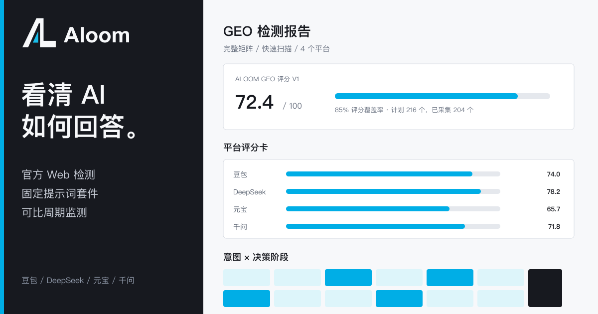
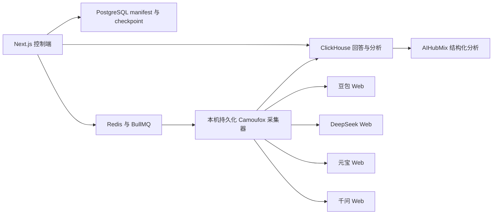

<p align="center">
  
</p>

<h1 align="center">Aloom GEO 检测</h1>

<p align="center">
  通过豆包、DeepSeek、元宝和千问的官方 Web 页面，检测现有产品在生成式 AI 回答中的可见性。
</p>

<p align="center">
  <a href="./README.md">English</a> · <strong>简体中文</strong>
</p>

Aloom 是一个可自托管的 GEO 检测与周期监测工具。它使用固定且可版本化的提示词套件，通过真实官方 Web 页面采集回答，并以样本级 checkpoint、结构化分析和可比报告评估产品的 AI 可见性。模型 API 不会被用来替代官方 Web 监测样本。



### 检测指标

- 品牌与产品的出现率、候选率和推荐率。
- 绝对排名、情感、目标份额和竞品份额。
- 品牌盲测与品牌显式测试之间的差异。
- 页面可见信源、已抽取引用和引用支持度。
- 对照已确认公开资料的事实准确性。
- 多轮采样中的回答稳定性。
- 分开统计采集完成率与结构化分析成功率。

失败、阻塞和未执行的 checkpoint 都会保留在报告分母中。`not_exposed` 仅表示平台页面没有暴露可抽取链接，不代表回答没有底层信源。

### 评分模型

Aloom 明确区分两层评分：

- **单回答表现分（Answer Performance Score）**：每条已分析回答分别计算可见性、排名、情感和推荐度，四项各占 25%；正式计划中未完成或分析失败的样本在 series 平均分中按零计入。
- **Aloom GEO Score v1**：面向整次检测的六维加权分。系统会分别计算总报告分数以及豆包、DeepSeek、元宝、千问各自的独立分数。

| 检测维度 | 权重 | 衡量内容 |
| --- | ---: | --- |
| 可见性 | 25% | 品牌在全部计划样本中的实际出现情况。 |
| 证据性 | 20% | 页面可见信源与回答断言的证据支持度。 |
| 事实性 | 15% | 回答与用户已确认事实台账之间的准确性。 |
| 竞争性 | 20% | 目标品牌相对于已抽取竞品的回答份额。 |
| 稳定性 | 10% | 相同模式、相同提示词的多轮回答一致性。 |
| 治理完整性 | 10% | 采集、分析和必需检测维度的完成情况。 |

无法评估的维度不会被悄悄计为零。系统会在已有维度上归一化总分，单独展示已评估权重形成的**评分覆盖率**；覆盖率不足 100% 或正式 series 未完整完成时，报告会明确标记为暂定结果。这套权重由 Aloom 独立设计和版本化。

每个平台报告均包含独立总分、六维明细、单回答表现分、采集与分析完成率、出现率、推荐率、绝对排名、情感、可见信源曝光、目标份额、竞品份额、模式 cohort、失败分类、实际提示词、原始回答、引用和对话证据。

### 检测流程

1. 扫描产品官网。
2. 确认品牌、品类、产品、受众、地区和竞品。
3. 选择检测套件、语言、平台、官方 Web 模式和采样深度。
4. 预览实际提示词、样本数量和预计周期，然后点击 **Run detection**。
5. Aloom 自动记录本次配置，并在独立的新对话中执行每条提示词。
6. 按平台、模式、语言、意图、阶段、品牌暴露方式、实体或单条提示词查看报告。
7. 使用同一版本化检测配置创建周度或月度周期监测。

正式检测不接受任意自定义提示词。历史 custom 与 legacy 提示词仍与原始样本关联，但不会进入新的正式检测和报告。

### Aloom GEO Detection Pack v1.1

每种语言内置 54 条固定模板，由 9 类意图和 6 个决策阶段组成。

| 套件 | 检测矩阵 | 每种语言的核心题数 |
| --- | --- | ---: |
| Quick Scan | 全部意图 × 认知、评估 | 18 |
| Discovery | 信息、推荐、场景、替代 × 前三个阶段 | 12 |
| Competitive Position | 推荐、比较、替代 × 筛选、评估、采购 | 9 |
| Trust & Risk | 风险、价格、品牌验证 × 筛选、评估、采购 | 9 |
| Buyer Journey | 全部意图 × 认知到采购 | 36 |
| Full Matrix | 完整 9 × 6 矩阵 | 54 |

高级筛选支持语言、意图、阶段、品牌盲测或显式测试、产品、竞品、受众和地区。系统以确定性方式分配实体，覆盖器只补充必要缺口，不生成完整笛卡尔积。

采样深度与提示词覆盖范围相互独立：

- `Single`：每个提示词与平台组合采样一次。
- `Reliable`：采样两轮，两轮至少间隔 6 小时。
- `Stability`：采样三轮，并分布在三个自然日。

### 官方 Web 模式与联网搜索

Aloom 会分别保存请求模式和页面验证后的实际模式。联网与非联网 cohort 不会混合统计。

| 平台 | 支持的文本检测 cohort | 联网规则 |
| --- | --- | --- |
| 豆包 | 快速、专家 | GEO 文本基线不包含办公 Agent 模式。 |
| DeepSeek | 快速、专家、DeepThink、快速 + Search | Search 只能与 Instant/快速模式组合；系统会拒绝 DeepThink + Search。 |
| 元宝 | 默认、深度思考、Search、深度思考 + Search | 联网必须从 `Tool > Search` 显式选择。 |
| 千问 | Auto、Fast、Thinking 及各自的联网组合 | 联网必须通过 `+ > More > Web search` 选择；系统会验证输入框中的独立搜索标记，不能把通用 `Tools` 开关当作联网凭据。 |

如果平台 UI 发生变化或开关状态无法验证，样本会以具体的模式错误失败，不会被错误标记为联网成功。

### 浏览器采集与隐私

本机采集器使用任务绑定的无头 Camoufox，每个平台持久化一个独立 profile。登录态、Cookie、localStorage、浏览器身份和 profile 始终保存在用户电脑，不上传到控制端。

- 每个浏览器页面都必须绑定到具体采集任务。
- 任务结束时会统一关闭该任务拥有的全部页面。
- 每条正式提示词都创建独立的新对话。
- 已确认发送的提示词不会因为抽取失败而重复提交。
- 登录失效、扫码、验证码、滑块和安全确认会进入 `waiting_human`。
- 人工处理会使用同一持久 profile 打开可见窗口；Aloom 不破解或绕过验证。
- 浏览器、采集器或验证流程恢复后会继续使用 checkpoint，不重复已完成样本。

AIHubMix 只负责分析已经采集到的 Web 回答。Full Matrix 不会把 54 个回答放进同一个模型上下文：每个回答分别执行一次受 Schema 约束的分析，再由代码确定性聚合报告。

### 系统架构



### 本地安装

环境要求：macOS 或 Windows、Node.js 20+、pnpm 10+、Docker Desktop 和 Python 3.12。

```bash
git clone https://github.com/MYZ8088/aloom.git
cd aloom
cp .env.example .env
pnpm install
pnpm camoufox:setup
pnpm camoufox:doctor
pnpm local:background
```

打开 `http://localhost:3000`，然后在 `Providers` 页面连接各个平台。后台运行进程不会随启动终端关闭而退出。持久 profile 保存在 `.aloom-storage/` 中，该目录已排除在 Git 之外。

如果安装来自项目的早期命名版本，请在首次执行 `pnpm local` 前运行一次 `pnpm brand:migrate-runtime`。该命令会复制旧 Docker volume 和本机浏览器状态、核验 volume 大小、保留旧 volume，并备份不完整的目标 volume。

常用命令：

```bash
pnpm camoufox:doctor  # 检查 Python、Camoufox、浏览器、GeoIP 和可执行文件
pnpm local            # 在前台运行 Web 和采集器，用于开发调试
pnpm local:background # 启动不依赖终端会话的本地运行进程
pnpm local:status     # 检查运行进程和 Web 服务状态
pnpm local:stop       # 平滑停止后台运行进程
pnpm collector        # 只启动本机采集器
pnpm test             # 运行单元测试和 fixture 测试
pnpm typecheck        # 检查工作区 TypeScript 类型
pnpm build            # 执行语言、隐私检查与生产构建
```

后台日志保存在 `.aloom-storage/logs/local-daemon.log`。BullMQ 任务意外中断后会依据 PostgreSQL checkpoint 跳过已经终结的样本，只恢复未完成 Prompt。

### 可靠性规则

- 只有全部预期 Prompt hash 都建立 checkpoint 来源后，正式 series 才能启动。
- 每个平台并发固定为 1；所选平台默认并行运行，全局上限由 `COLLECTOR_PROVIDER_CONCURRENCY` 控制（默认 `4`），低资源机器自动降为 `2`。
- 结构化分析使用独立的后台有限并发通道，由 `COLLECTOR_ANALYSIS_CONCURRENCY` 控制（默认 `2`），不会阻塞官方 Web 采集。
- 浏览器重启后继续使用同一个持久身份和 profile。
- Prompt 回显、登录页、验证页、平台错误页和空回答会被拒绝。
- 采集状态与分析状态分开保存。
- 结构化分析使用严格 JSON Schema、平衡 JSON 提取、本地修复、Zod 校验、备用模型和一次定向修复。
- 趋势只比较 Prompt hash、平台、模式、语言和采样定义完全一致的 series。
- 采集器离线时任务进入 `waiting_runner`，不会丢弃整个 series。

### 项目来源与许可证

Aloom 是独立项目，不是 OneGlanse 或 Yao GEO Skills 的官方版本。

- 初始代码和部分自托管架构借鉴并衍生自 [OneGlanse](https://github.com/aryamantodkar/oneglanse)，原作者 Aryaman Todkar，Copyright 2025，MIT License。Aloom 在此基础上重构为纯检测产品，并新增持久化本机采集器、版本化运行 manifest、模式分 cohort、样本 checkpoint 和完整报告。
- Aloom 仅借鉴了 [Yao GEO Skills](https://github.com/yaojingang/yao-geo-skills) 固定提交 `136eb92c90946ea56ec63f912d5025bcbc884f39` 中部分提示词分类、意图挖掘和 Web 采样质量思路，Copyright 2026 Yao，MIT License。Aloom 并不是对该 Skill 的完整实现；提示词包、采集器、数据模型、评分和报告均由本项目独立维护，运行时也不依赖 Skill、Codex、OpenCLI 或远程仓库。
- Aloom 本项目使用 Apache-2.0，Copyright 2026 MYZ8088。

完整声明见 [LICENSE](LICENSE) 和 [NOTICE](NOTICE)。

### 当前限制

- 平台页面更新后可能需要维护适配器。
- 验证码和账号安全确认必须由用户处理。
- 官方 Web 采集面向有人使用的 macOS 或 Windows 本机，不支持无人值守 Linux VPS。
- 检测结果是对平台输出的观察性测量，不承诺曝光结果，也不代表确定因果关系。
